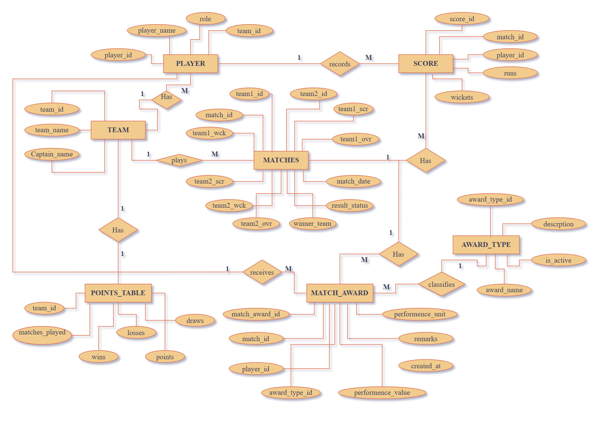

<div align="center">

# 🏏 Cricket Tournament Management System

### A complete cricket tournament management platform for organizers, administrators, and users

[](#)
[](#)
[](#)
[](#)
[](#)

[](#)
[](#)

**Teams · Players · Matches · Live Scores · Player Statistics · Awards · Points Table · User Management**

<br>

[](https://crickettournament.free.nf/)
[](https://github.com/mehedi77k/Cricket_Tournament_Management_System)

</div>

---

## About the Project

**Cricket Tournament Management System** is a complete web-based platform designed to make cricket tournament organization simple, clear, and manageable from one place.

Tournament administrators can create teams, add players, schedule matches, update live and final scores, record individual player performances, assign awards, manage users, and maintain the tournament points table.

Regular users can register for an account, receive approval from an administrator, and then view tournament information such as recent match results, standings, and their personal profile.

The project includes three user levels: **Super Admin, Admin, and User**, allowing each person to access only the features that are appropriate for their role.

---

## Main Features

### 👤 User Features

Registered and approved users can:

- Sign in to the tournament system
- View the tournament dashboard
- View tournament summary information
- Check recent match results
- View the current points table
- View match scores and result information
- Update personal profile information
- Change account password
- Log out securely

> New user registrations remain pending until an Admin or Super Admin approves the account.

---

### 🛠️ Admin Features

Administrators can:

- View a complete tournament dashboard
- Add, edit, and remove teams
- Add, edit, and remove players
- Assign players to teams
- Manage player roles
- Schedule matches between teams
- Enter pending, live, and completed match information
- Update team runs, wickets, and overs
- Manage live match scores
- Record individual player runs and wickets
- Create and manage award types
- Assign match awards to players
- Recalculate and view the tournament points table
- Approve new user registrations
- View recent matches and tournament standings
- View top run scorers
- View top wicket takers
- Update personal profile and password

---

### 👑 Super Admin Features

The Super Admin has all regular Admin features, along with additional account-management options.

A Super Admin can:

- Create new Admin accounts
- Approve pending user registrations
- Reject user registrations
- Activate or deactivate accounts
- Manage Admin and User account status
- Access all tournament-management features
- Manage the system at the highest level

> The first Super Admin is created through a one-time setup page. After the first Super Admin is created, that setup page can no longer be used to create another Super Admin.

---

## How the System Works

```text
Create First Super Admin
          ↓
       Log In
          ↓
      Add Teams
          ↓
      Add Players
          ↓
   Create Award Types
          ↓
    Schedule Matches
          ↓
 Pending / Live / Completed
          ↓
   Enter Match Scores
          ↓
Record Player Performance
          ↓
    Assign Match Awards
          ↓
 Recalculate Points Table
          ↓
View Standings & Statistics
```

This process allows tournament organizers to manage the complete tournament from team registration to final standings and player awards.

---

## User Roles

| User Type | Main Purpose |
|---|---|
| **User** | View tournament information, recent match results, points table, and personal profile |
| **Admin** | Manage teams, players, matches, scores, awards, points, and approve users |
| **Super Admin** | Full tournament control, including Admin and User account management |

---

## Team and Player Management

The system allows administrators to organize tournament teams and their players.

### Team Management

Administrators can:

- Add a new team
- Edit team information
- Remove a team
- Store the team name
- Store the captain's name
- View all registered teams

### Player Management

Administrators can:

- Add new players
- Edit player information
- Remove players
- Assign each player to a team
- Select a playing role

Available player roles include:

```text
Batsman
Bowler
All-Rounder
Wicket Keeper
```

---

## Match Management

Administrators can schedule matches between two different teams and update the match as the tournament progresses.

Each match can include:

- Match date
- Team 1
- Team 2
- Team 1 runs
- Team 1 wickets
- Team 1 overs
- Team 2 runs
- Team 2 wickets
- Team 2 overs
- Match status
- Winning team

The system supports the following match conditions:

```text
Pending
Live
Completed
Draw
```

When a completed match has a higher score for one team, the winner is determined from the entered scores. If both teams finish with the same score, the match is recorded as a draw.

---

## Live Score Management

A match can be marked as **Live / In Progress** while it is being played.

During a live match, administrators can update:

- Runs
- Wickets
- Overs

The live score is saved and can be shown on the tournament dashboards so users can follow the current match information without waiting for the final result.

The system also checks cricket over values such as:

```text
15
15.2
19.5
20
```

---

## Player Performance

Individual player performance can be recorded for each match.

Administrators can enter:

- Player
- Match
- Runs
- Wickets

This information is used to maintain player records and display tournament leaders such as:

- **Top Run Scorers**
- **Top Wicket Takers**

---

## Awards Management

The system allows administrators to create different tournament awards and assign them to players.

Example award types may include:

```text
Player of the Match
Best Batsman
Best Bowler
Best Fielder
```

Award records can include:

- Match
- Award type
- Award recipient
- Performance value
- Performance unit
- Remarks

An award type can also be marked as active or inactive.

---

## Points Table

The tournament points table is calculated from completed and drawn matches.

Current points rules:

| Result | Points |
|---|---:|
| **Win** | 2 |
| **Draw** | 1 |
| **Loss** | 0 |

The table displays:

- Position
- Team
- Captain
- Matches played
- Wins
- Losses
- Draws
- Points

Teams are ranked mainly by points, followed by wins, draws, losses, and team name when needed.

> Live and pending matches are not included in the points calculation.

---

## Admin Dashboard

The Admin dashboard provides a quick overview of the tournament.

It includes information such as:

- Total registered teams
- Total players
- Scheduled matches
- Recent matches
- Current standings
- Top run scorers
- Top wicket takers
- Quick tournament-management options

This gives administrators a simple summary of the tournament from one page.

---

## User Dashboard

Approved users receive a separate dashboard designed mainly for viewing tournament information.

The User dashboard includes:

- Tournament summary
- Number of teams
- Number of players
- Number of matches
- Recent match results
- Match scores
- Current points table

Users cannot edit tournament records.

---

## Account and Access Control

The project separates access between User, Admin, and Super Admin accounts.

The system includes protection for:

- Account passwords
- Login sessions
- Admin-only pages
- Super Admin-only actions
- User approval
- Account activation and deactivation
- Form submissions
- Tournament-management actions

Passwords are not stored as plain text.

---

## System Workflow


---

## Database Overview

The project stores tournament information in several connected sections.

Main data groups include:

| Data Section | Purpose |
|---|---|
| **Users** | Stores Super Admin, Admin, and User accounts |
| **Team** | Stores team and captain information |
| **Player** | Stores player details, roles, and team assignment |
| **Matches** | Stores match schedule, scores, overs, wickets, and results |
| **Score** | Stores individual player runs and wickets |
| **Award Type** | Stores available award categories |
| **Match Award** | Stores awards assigned to players for matches |
| **Points Table** | Stores tournament standings |

Entity RelationShip Diagram:



---

## Project Structure

```text
cricket_tournament_app/
│
├── api/
│   ├── live_match_update.php
│   ├── live_scores.php
│   └── players_by_match.php
│
├── assets/
│   ├── css/
│   │   └── style.css
│   └── js/
│       └── app.js
│
├── config/
│   ├── database.php
│   └── db.php
│
├── includes/
│   ├── bootstrap.php
│   ├── footer.php
│   ├── functions.php
│   └── header.php
│
├── award_types.php
├── awards.php
├── index.php
├── login.php
├── logout.php
├── matches.php
├── players.php
├── points.php
├── profile.php
├── register.php
├── scores.php
├── setup_admin.php
├── teams.php
├── user_dashboard.php
├── users.php
│
├── CTMSDB.drawio.png
├── System workflow.png
├── LICENSE
└── README.md
```

---

# Running the Project on Your Computer

The easiest way to run the project locally is with **Laragon**.  
You can also use **XAMPP** or **WAMP**.

---

## Option A — Run with Laragon

### 1. Install and Start Laragon

Start:

```text
Apache
MySQL
```

---

### 2. Download the Project

Open PowerShell or Terminal inside:

```text
C:\laragon\www
```

Run:

```bash
git clone https://github.com/mehedi77k/Cricket_Tournament_Management_System.git
```

Rename the downloaded folder if needed:

```text
cricket_tournament_app
```

The project can then be placed at:

```text
C:\laragon\www\cricket_tournament_app
```

---

### 3. Create the Database

Open:

```text
http://localhost/phpmyadmin/
```

Create a new database named:

```text
cricket_tournament_db
```

The project expects the following main tables:

```text
users
team
player
matches
score
award_type
match_award
points_table
```

> The current repository does not include a separate `.sql` database export file. The included `CTMSDB.drawio.png` file shows the main tournament database structure. If you already have the project database, import it into `cricket_tournament_db`.

---

### 4. Check Database Settings

Open:

```text
config/db.php
```

The default local settings are:

```php
$DB_HOST = 'localhost';
$DB_NAME = 'cricket_tournament_db';
$DB_USER = 'root';
$DB_PASS = '';
```

If your MySQL account uses a password, update `$DB_PASS`.

---

### 5. Open the Project

Visit:

```text
http://localhost/cricket_tournament_app/
```

If this is a fresh installation, create the first Super Admin before using the rest of the system.

---

## Option B — Run with XAMPP

Place the project inside:

```text
C:\xampp\htdocs\cricket_tournament_app
```

Start **Apache** and **MySQL** from the XAMPP Control Panel.

Create the database:

```text
cricket_tournament_db
```

Then open:

```text
http://localhost/cricket_tournament_app/
```

---

## First Super Admin Setup

For a fresh installation, open:

```text
http://localhost/cricket_tournament_app/setup_admin.php
```

Enter:

- Full name
- Email
- Phone number, if needed
- Password
- Password confirmation

The first account created from this page becomes the **Super Admin**.

After the first Super Admin exists, the setup page will no longer create another Super Admin account.

Additional Admin accounts must be created by the Super Admin from the account-management page.

---

## User Registration

Normal users can register from:

```text
http://localhost/cricket_tournament_app/register.php
```

After registration:

```text
User Registers
      ↓
Account Status = Pending
      ↓
Admin / Super Admin Reviews Account
      ↓
Account Approved
      ↓
User Can Log In
```

---

## Login

All account types use:

```text
http://localhost/cricket_tournament_app/login.php
```

After login:

- **User** → User Dashboard
- **Admin** → Admin Dashboard
- **Super Admin** → Admin Dashboard with full account-management access

---

## Recommended Tournament Setup Order

For a fresh tournament, use the following order:

```text
1. Create the first Super Admin
2. Log in
3. Create additional Admin accounts if required
4. Add teams
5. Add players and assign teams
6. Create award types
7. Schedule matches
8. Update live or completed match scores
9. Enter individual player runs and wickets
10. Assign match awards
11. Recalculate the points table
12. Review standings and tournament statistics
```

---

## Basic Testing Checklist

After setup, confirm that:

- [ ] Login page opens correctly
- [ ] First Super Admin setup works
- [ ] User registration works
- [ ] Admin can approve a pending user
- [ ] User can log in after approval
- [ ] Admin dashboard opens correctly
- [ ] Teams can be added and edited
- [ ] Players can be added and assigned to teams
- [ ] Matches can be scheduled
- [ ] A match can be marked as Live
- [ ] Live runs, wickets, and overs can be updated
- [ ] Completed match results are stored correctly
- [ ] Draw matches are handled correctly
- [ ] Player runs and wickets can be recorded
- [ ] Award types can be created
- [ ] Match awards can be assigned
- [ ] Points table can be recalculated
- [ ] Top run scorers are displayed
- [ ] Top wicket takers are displayed
- [ ] User dashboard displays recent results and standings
- [ ] Profile information can be updated
- [ ] Password change works
- [ ] Super Admin can create Admin accounts
- [ ] Super Admin can activate or deactivate accounts

---

## Common Problems

| Problem | What to Check |
|---|---|
| Website does not open | Make sure Apache is running and the project is inside the correct web folder |
| Database connection fails | Make sure MySQL is running and check `config/db.php` |
| Database connection page appears | Confirm that `cricket_tournament_db` exists |
| Page shows database-table errors | Confirm that all required project tables have been created |
| Super Admin setup does not work | Make sure the `users` table exists and no Super Admin has already been created |
| User cannot log in after registration | The account must first be approved by an Admin or Super Admin |
| Match cannot be created | Select two different teams and enter a valid match date |
| Live score does not save | Make sure the match status is set to **Live / In Progress** |
| Overs are rejected | Use cricket over format such as `15`, `15.2`, or `19.5` |
| Points table is outdated | Open the Points Table page and select **Recalculate Points** |
| Changes do not appear | Refresh the browser or perform a hard refresh |

---

## Updating Your Local Copy

If the project is already downloaded from GitHub, open PowerShell or Terminal inside the project folder and run:

```bash
git pull origin main
```

---

## Main Tools Used

The project is built with common web-development tools:

| Tool | Used For |
|---|---|
| **PHP** | Runs tournament and account-management features |
| **MySQL / MariaDB** | Stores teams, players, matches, scores, awards, users, and standings |
| **HTML** | Builds the website pages |
| **CSS** | Controls the design and responsive layout |
| **JavaScript** | Adds interactive behavior and live score updates |
| **Apache** | Runs the website locally or on a web server |
| **phpMyAdmin** | Helps create and manage the database |

No large web framework is required.

---

## Project Purpose

The Cricket Tournament Management System was developed to organize the main activities of a cricket tournament in one place.

The project covers the complete tournament process:

```text
Teams
  ↓
Players
  ↓
Matches
  ↓
Live Scores
  ↓
Player Performance
  ↓
Awards
  ↓
Points Table
  ↓
Tournament Results
```

It can be used as:

- An academic project
- A database project
- A portfolio project
- A learning project
- A starting point for a larger tournament-management platform

---

## Future Improvements

Possible future additions include:

- Ball-by-ball scoring
- Net Run Rate calculation
- Tournament groups and knockout stages
- Semi-final and final bracket management
- Team logos and player photos
- Match venue management
- Match schedule calendar
- Public spectator dashboard without login
- Player batting and bowling averages
- More detailed tournament statistics
- Printable match and points-table reports
- Email or mobile notifications
- Multiple tournament support
- Match commentary
- Scorecard export as PDF

---

## Important Notes

- A normal user must be approved before logging in.
- The first Super Admin is created only once through `setup_admin.php`.
- A team cannot play against itself.
- Wickets must remain between `0` and `10`.
- Cricket overs must use valid ball notation.
- Win = **2 points**, Draw = **1 point**, Loss = **0 points**.
- Pending and live matches are not counted in the points table.
- Create a database backup before making major database changes.
- Do not publish real passwords or private account information in a public repository.

---

## Test Credentials

For testing and development purposes, use the following demo accounts:

| Account Type | Email | Password |
|---|---|---|
| **Super Admin** | superadmin@gmail.com | superadmin456# |
| **Admin** | admin@gmail.com | superadmin456# |
| **User** | user@gmail.com | superadmin456# |

---

## Links

| Resource | Link |
|---|---|
| 🌐 **Live Website** | [Visit Cricket Tournament Management System](https://crickettournament.free.nf/) |
| 💻 **GitHub Repository** | [View Source Code](https://github.com/mehedi77k/Cricket_Tournament_Management_System) |

Clone the project:

```bash
git clone https://github.com/mehedi77k/Cricket_Tournament_Management_System.git
```

---

## License

This project is licensed under the **MIT License**.

See the [`LICENSE`](./LICENSE) file for details.

---

## Acknowledgement

The Cricket Tournament Management System was developed as a complete tournament-management project covering team organization, player management, match scheduling, live scores, individual performance, awards, standings, and user access in a single platform.

---

<div align="center">

### 🏏 Cricket Tournament Management System

**Manage teams. Track matches. Follow scores. Organize the tournament.**

<br>

### Developed by **Mehedi Hasan**

</div>
